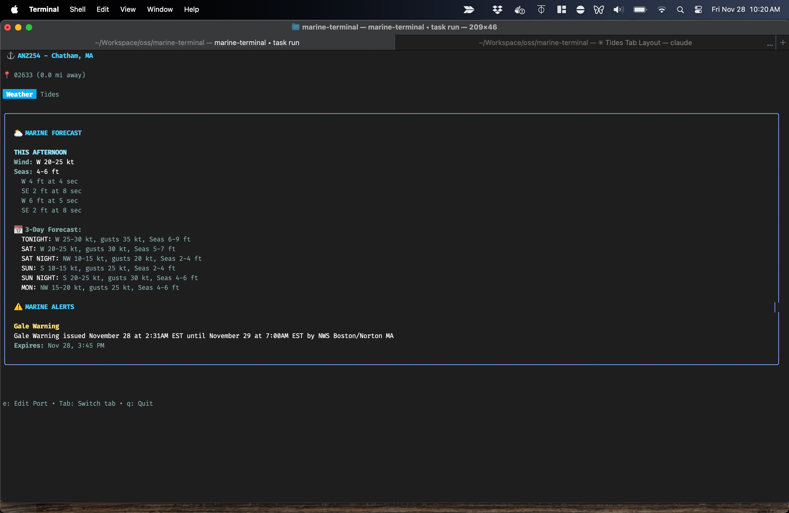

# Marine Terminal

A terminal-based application for displaying NOAA weather and tide information for US marine ports.



## Features

- **Marine Weather Conditions**: Current conditions and 3-day forecasts
- **NOAA Wind Predictions**: Wind speed, direction, and gusts in knots
- **Wave Heights**: Detailed wave/swell information with direction and period
- **Tide Predictions**: High and low tides for the next 3 days with visual chart
- **NOAA Marine Alerts**: Small craft advisories, gale warnings, and other marine alerts
- **Saved Ports**: Save and manage multiple port configurations for quick access
- **Smart Port Management**: Auto-loads last used port on startup
- **Port Search**: Search by ZIP code or city, state (e.g., 02633 or Chatham, MA)
- **Tabbed Interface**: Two-pane view with Weather and Tides tabs
- **Keyboard Navigation**: Full keyboard control with intuitive shortcuts

## Installation

### Prerequisites

- Go 1.21 or later
- (Optional) [Task](https://taskfile.dev) - Modern task runner for development

### Build from Source

```bash
# Clone the repository
git clone https://github.com/ngmaloney/marine-terminal.git
cd marine-terminal

# Download dependencies
go mod tidy

# Build the application
go build -o marine-terminal ./cmd/marine-terminal

# Run the application
./marine-terminal
```


### First Run: Automatic Data Provisioning

The application automatically downloads and configures marine zone data on first run:

```bash
./marine-terminal
```

**What happens on first run:**
1. Downloads NOAA marine zones shapefile (~12 MB)
2. Downloads zipcode CSV data (~42,000 zipcodes)
3. Builds SQLite database with 566+ marine forecast zones and zipcode data
4. Creates `data/marine-terminal.db` (~32 MB)
5. Cleans up temporary files

**Total time:** ~1-2 seconds

**Subsequent runs:** Instant - uses existing database

The marine zones database is **not** included in the repository and will be downloaded automatically when needed. No manual setup required!

### Manual Data Provisioning

The database provisions automatically, but you can verify or rebuild it:

```bash
# Remove database to trigger re-provisioning
rm -rf data/

# Run any application that uses zones
go run test_nearby_zones.go
```

The provisioning will:
- Download from: `https://www.weather.gov/source/gis/Shapefiles/WSOM/mz18mr25.zip`
- Extract marine zone boundaries (shapefiles)
- Build indexed SQLite database
- Store zone centers for distance calculations

## Usage

### Quick Start Guide

1. **Start the application**:
   ```bash
   ./marine-terminal
   ```

2. **First run**: If you have no saved ports, you'll enter the search screen
   - Type a ZIP code or city, state (e.g., `02633` or `Chatham, MA`)
   - Press Enter to search
   - Select a marine zone from the list
   - Enter a name for the port and press Enter to save

3. **View weather and tides**:
   - Weather tab shows current conditions, forecast, and alerts
   - Tides tab shows upcoming tide events and a visual chart
   - Use Tab to switch between Weather and Tides tabs

4. **Manage ports**:
   - Press `e` to view your saved ports
   - Select a port and press Enter to load it
   - Press `n` to add a new port
   - Press `d` to delete a port
   - Press `Esc` to return to the weather view

5. **Subsequent runs**: The app automatically loads your last used port

### Command-Line Arguments

You can launch the application with specific options:

```bash
# Load a saved port by name
./marine-terminal --port "Stage Harbor"

# Load a specific marine zone with location
./marine-terminal --station ANZ251 --location "Chatham, MA"

# Show help
./marine-terminal --help
```

**Available flags:**
- `--port <name>`: Load a saved port by name
- `--station <code>`: Specify a marine station code (requires --location)
- `--location <location>`: Specify location as ZIP code or city, state

### Keyboard Navigation

**In Display Mode (Weather/Tides View):**
- **Tab**: Switch between Weather and Tides tabs
- **e**: Edit/manage saved ports
- **q** or **Ctrl+C**: Quit the application

**In Saved Ports List:**
- **Enter**: Select and load a port
- **n**: Create a new port (starts search flow)
- **d**: Delete the selected port (with confirmation)
- **Esc**: Return to weather view (if a port is loaded)
- **q** or **Ctrl+C**: Quit the application

**In Search/Input Modes:**
- **Type**: Enter ZIP code or city, state (e.g., "02633" or "Chatham, MA")
- **Enter**: Submit search or input
- **Esc**: Go back to previous screen
- **Ctrl+C**: Quit the application

**In Zone Selection:**
- **↑/↓**: Navigate through marine zones
- **Enter**: Select a zone
- **Esc** or **s**: Return to search
- **q** or **Ctrl+C**: Quit the application

## Marine Data Formats

The application displays marine conditions in NOAA format:

### Wind
```
W 15-20 kt, gusts 30 kt
```
- Direction (W = West)
- Speed range in knots
- Gust speed if applicable

### Seas
```
Seas 5-7 ft
Wave Detail:
  S 5 ft at 8 seconds
  W 4 ft at 5 seconds
```
- Overall sea height range
- Individual wave components with:
  - Direction (S = South swell, W = West swell)
  - Height in feet
  - Period in seconds

### Tides
```
Upcoming Tides:
  Nov 27, 2:15 PM   Low   0.5 ft
  Nov 27, 8:45 PM   High  5.2 ft
  Nov 28, 3:20 AM   Low   0.3 ft

[Visual tide chart displayed below the table]
```
- Station information and current conditions
- Table of upcoming tide events (next 6 tides)
- Visual Braille chart showing tide height over time
- All heights in feet relative to MLLW datum

## Coverage

**Marine Forecast Zones:**
- **566+ NOAA marine forecast zones** covering all US coastal waters
- Auto-downloaded from official NOAA shapefiles on first run
- Distance-based search finds zones near any location

**Tide Stations:**
- **3,379+ NOAA tide prediction stations** across the United States
- Automatically finds the nearest tide station to your selected zone
- Includes all coastal states: MA, CA, WA, NY, FL, TX, OR, NC, AK, HI, and more
- Examples: Chatham, Woods Hole, Seattle, San Francisco, Boston, New York

**Location Search:**
- Search by ZIP code (e.g., "02633", "98101")
- Search by city and state (e.g., "Chatham, MA", "Seattle, WA")
- **42,000+ ZIP codes** for accurate location lookup

## Development

### Using Task (Recommended)

This project uses [Task](https://taskfile.dev) for common development tasks. Task is a modern alternative to Make, written in Go.

**Install Task:**
```bash
# macOS
brew install go-task/tap/go-task

# Or using Go
go install github.com/go-task/task/v3/cmd/task@latest
```

**Common Commands:**
```bash
# Show all available tasks
task --list

# Build the application
task build

# Run the application
task run

# Run tests
task test

# Run tests with coverage
task test:coverage

# Format and lint code
task dev

# Check data provisioning status
task data:check

# Provision marine zones database
task data:provision

# Clean all generated files
task clean:all

# Show project info
task info
```

**Quick Development Workflow:**
```bash
# Format, lint, and test in one command
task dev

# Build and run
task build run

# Full CI check (lint + coverage + race detection)
task ci
```

### Manual Build (Without Task)

If you prefer not to use Task, you can use standard Go commands:

```bash
# Build
go build -o marine-terminal ./cmd/marine-terminal

# Run
go run ./cmd/marine-terminal

# Test
go test ./...
```

### Project Structure

```
marine-terminal/
├── cmd/
│   └── marine-terminal/      # Main application
├── internal/
│   ├── database/         # SQLite database management
│   ├── geocoding/        # ZIP code and location geocoding
│   ├── models/           # Data models (Weather, Tide, Alert, Port)
│   ├── noaa/             # NOAA API clients
│   ├── ports/            # Port management service (save, load, delete)
│   ├── stations/         # Tide station lookup and management
│   ├── zonelookup/       # Marine zones database and provisioning
│   └── ui/               # Bubble Tea UI components
├── data/                 # Auto-generated (excluded from git)
│   └── marine-terminal.db        # SQLite database with saved ports, marine zones, and zipcodes
├── testdata/             # Test fixtures
└── CLAUDE.md             # Development guide for Claude Code
```

## Data Sources

- **Stations**: [NOAA CO-OPS Metadata API](https://api.tidesandcurrents.noaa.gov/mdapi/prod/)
- **Marine Zones**: [NOAA Marine Zones Shapefile](https://www.weather.gov/gis/MarineZones) (auto-downloaded)
- **Weather**: [NOAA Weather API](https://www.weather.gov/documentation/services-web-api)
- **Tides**: [NOAA CO-OPS API](https://tidesandcurrents.noaa.gov/api/)
- **Alerts**: [NOAA Weather Alerts API](https://www.weather.gov/documentation/services-web-api)
- **ZIP Codes**: [SimpleMaps US ZIP Codes Database](https://simplemaps.com/data/us-zips) (bundled, Basic version - free for commercial use)

### Local Database

The application uses a SQLite database (`data/marine-terminal.db`) that stores:

**Marine Zones Data (auto-provisioned on first run):**
- **566+ NOAA marine forecast zones** covering all US coastal waters
- **42,000+ ZIP codes** for fast location lookup
- **Distance-based lookup** - finds zones within configurable radius
- **Sorted by proximity** - shows nearest zones first
- **No static data in repo** - all data from official NOAA shapefiles and CSV sources

**User Data (persisted across sessions):**
- **Saved ports** - your configured port locations with names
- **Auto-load** - remembers your last viewed port
- All data stored locally (excluded from git)

## Technologies

- **[Bubble Tea](https://github.com/charmbracelet/bubbletea)**: Terminal UI framework (Elm Architecture)
- **[Lipgloss](https://github.com/charmbracelet/lipgloss)**: Styling and layout
- **[Bubbles](https://github.com/charmbracelet/bubbles)**: TUI components (lists, text inputs, spinners)
- **[ntcharts](https://github.com/NimbleMarkets/ntcharts)**: Terminal charts for tide visualization
- **[modernc.org/sqlite](https://gitlab.com/cznic/sqlite)**: Pure Go SQLite (no CGO required)
- **[go-shp](https://github.com/jonas-p/go-shp)**: Shapefile reader for GIS data

## Contributing

Contributions are welcome! Please ensure:
- All tests pass: `task test`
- Code is formatted: `go fmt ./...`
- Follow Go best practices

See [CLAUDE.md](CLAUDE.md) for detailed development guidelines.

## License

This project is provided as-is for educational and personal use.

## Acknowledgments

- NOAA for providing free marine weather data APIs
- Charm.sh for the excellent Bubble Tea framework
- SimpleMaps for the [US ZIP Codes Database](https://simplemaps.com/data/us-zips) (Basic version, free for commercial use)
